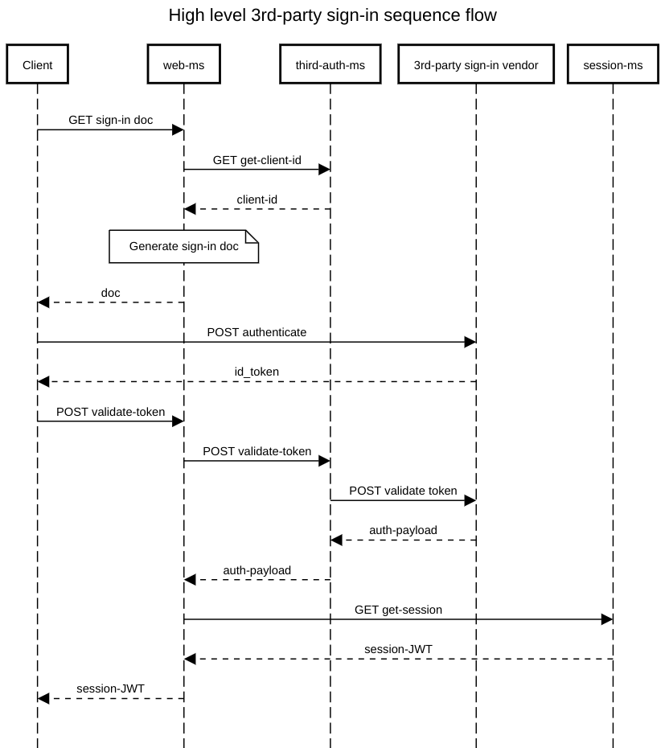

# third-auth-ms

A micro-service for authentication before using 3rd-party APIs.

Sometimes your app requires to integrate with 3rd party API's on behalf of the signed in user.
When this happens, you need to validate the user's 3rd-party sign-in token with the 3rd-party vendor.
After the user's made the sign-in the app will need to take the token generated and validate it with the 3rd-party to gain access.

This micro-service aims to help you integrate with those 3rd-party authenticators.

## What does it do?

Once set up and triggered this micro-service initiates an authentication flow which validates the user against the 3rd-party authentication vendor, and if valid, returns the user's approved details to share with your application, and of course, a token which later can be used to authenticate any calls to that 3rd party.

## How does it do that?

Every respectable authentication vendor has means to preform this validation. This micro-service simply consolidates the different vendors and exposes an abstraction API to work with them.

This micro-service is intended to work with other micro-services which construct your application.
Common flow of integrating the third-auth-ms in your system might be:


## Currently supported vendors

-   Google
-   GitHub
-   More to come... :)

## Usage

If you're interested in creating a docker container for this micro-service, please see the relevant Docker sections below. For the sake of demos create a `.env` file where you will put the following details.  
**Note** that vendor related variables are needed according to the vendor you wish to use.
| KEY | Context | Description |  
|- |- |:- |
| PORT | Server | The port the micro-service server is going to run on |
| HOST | Server | The host IP the micro-service server is going to run on, default is 0.0.0.0|
| CERT_PASSPHRASE | Server | HTTPS certificate pass-phrase |
| KEY_PEM_FILE_PATH | Server | HTTPS certificate encryption key file path |
| CERT_PEM_FILE_PATH | Server | HTTPS certificate file path |
| GOOGLE_CLIENT_ID | Google | Your Google application client ID, if you want to authenticate using Google |
| GOOGLE_CLIENT_SECRET | Google | Your Google application client secret, if you want to authenticate using Google |
| GITHUB_CLIENT_ID | GitHub | Your GitHub application client ID, if you want to authenticate using GitHub |
| GITHUB_CLIENT_SECRET | GitHub | Your GitHub application client secret, if you want to authenticate using GitHub |

## Demos

### Google

Given that you have Google client ID and Google client secret
(If you don't know what these are please see here: https://developers.google.com/identity/sign-in/web/sign-in) -  
Launch the server by running `npm start` and navigate to `https://localhost:<port>/auth/google/demo`  
You will see a Google sign-in button. Clicking this button will initiate an authentication process with Google. When the authentication succeeds it takes the user's token and attempts to validate it, and if that goes well you will get the authenticated user's detail displayed in the textarea below.

### GitHub

Given that you have GitHub client ID and GitHub client secret
(If you don't what these are please see here: https://developer.github.com/apps/building-oauth-apps/authorizing-oauth-apps/) -  
Launch the server by running `npm start` and navigate to `https://localhost:<port>/auth/github/demo`
You will see a GitHub sign-in button
The GitHub demo page performs authentication and then redirects back to demo page since this is the **callback URI**, and only then it validates the auth token with this micro-service to display the result on the demo page.
The developer needs to define the **callback URI** on GitHub application settings for this demo to work.

## Docker

### Building the Docker image

If you would like to build the docker image, simply run `npm run build-docker-image`
Now when you run `docker images` to inspect your installed images, you will see the third-auth-ms image in the list.
Note: the `.env` file is not included in the image.

### Creating a docker container using docker-compose

If you would like to create a Docker container derived fom the image you've just made, the easiest way to go about it is to create a `docker-compose.yml` file and run it using `docker-compose up`, just for the sake of defining the environment variable in a maintainable manner. Below is an example for such file which define the different

```yml
version: '3.3'

services:
    third-auth-ms:
        image: third-auth-ms

        environment:
            PORT: 1970
            HOST: 0.0.0.0
            CERT_PASSPHRASE: 'your-cert-passphrase'
            KEY_PEM_FILE_PATH: 'path-to-key.pem'
            CERT_PEM_FILE_PATH: 'path-to-cert.pem'
            COOKIE_SECRET: 'your-cookie-secret'
            GITHUB_CLIENT_ID: 'your-github-client-id'
            GITHUB_CLIENT_SECRET: 'your-github-client-secret'
            GOOGLE_CLIENT_ID: 'your-google-client-id'
            GOOGLE_CLIENT_SECRET: 'your-google-client-secret'

        ports:
            - 8080:1970
```

_Note: Lunching the container this way means the demos will not work unless you set the ports mapping to be the same, e.g. `1970:1970`, but for the demos it is better to just run the `npm start` with the relevant `.env` file._
